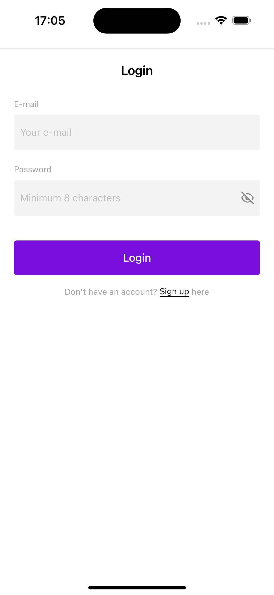
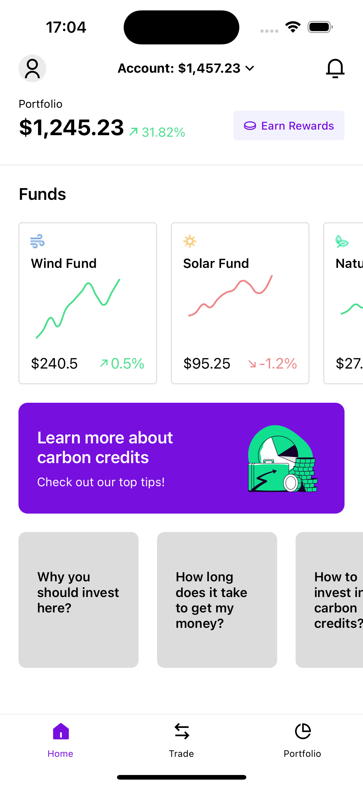
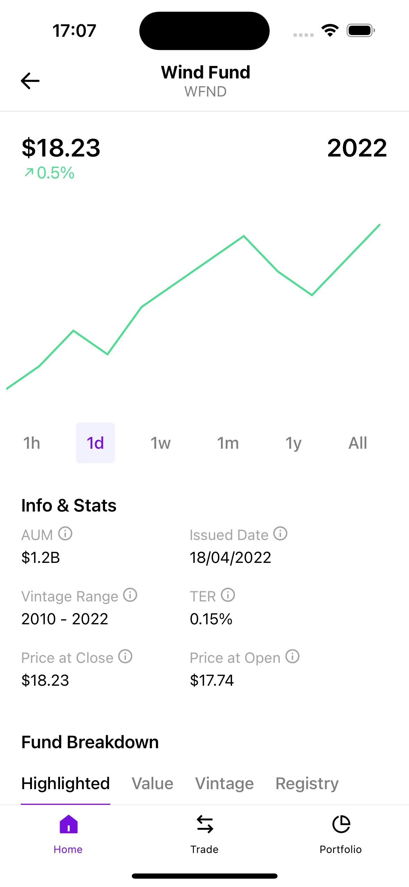
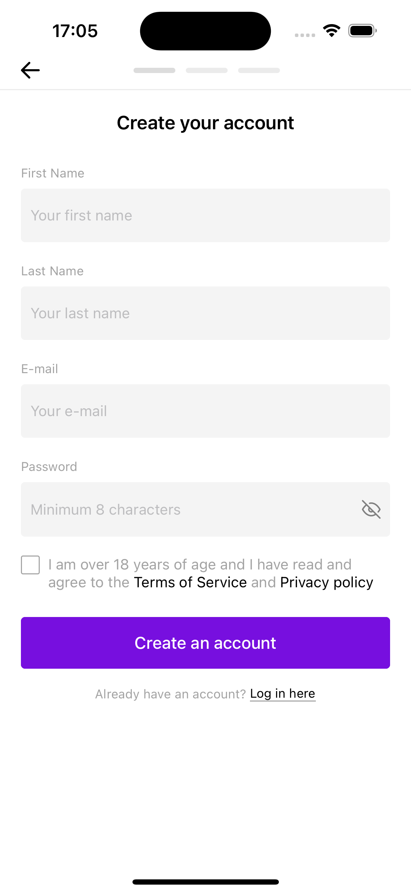
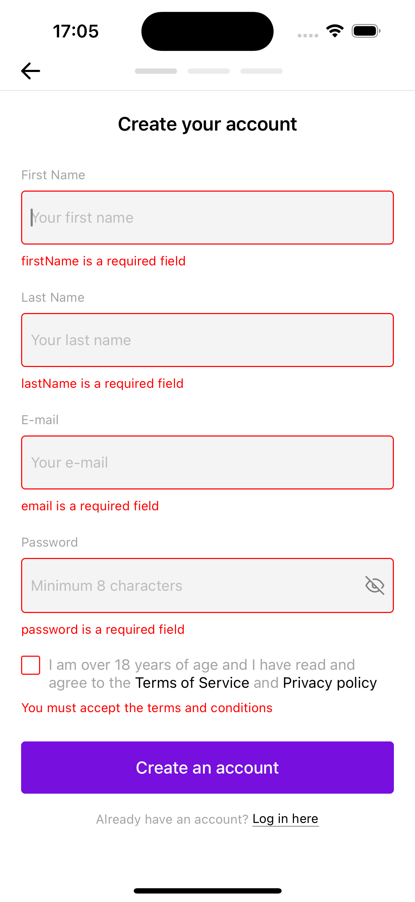
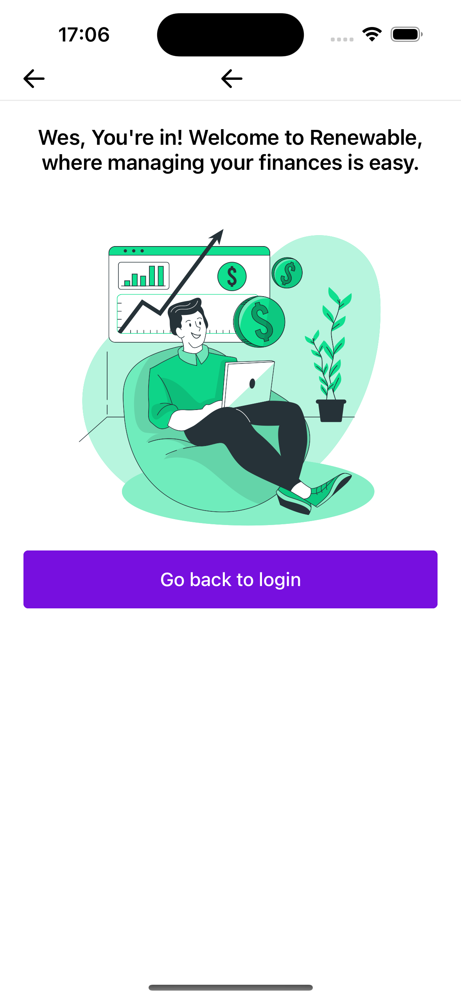

# Renewable Energy FundApp
This is a mobile app built with React Native that allows users to view and manage their investment funds. It includes several screens for user authentication, fund management, and data visualization.

## Screenshots
- Login screen: This is the screen where users can log in to the app. It includes fields for entering a email and password, as well as a button to submit the form.
- Account screen: This is the main screen of the app, where users can view a summary of their account information and navigate to other sections of the app. It includes buttons for viewing account details, trade, and more.
- Fund details screen: This screen shows detailed information about a specific investment fund, including a line chart showing the fund's performance over time. Users can also view the fund's price and percentual variation.

<table>
  <tr>
    <td></td>
    <td></td>
    <td></td>
  </tr>
<tr>
    <td></td>
    <td></td>
    <td></td>
  </tr>
</table>


## Installation
To get started, clone the repository and run npm install to install all dependencies:

```bash
git clone https://github.com/wesleyguirra/renewable-energy-fund-app
cd renewable-energy-fund-app
npm install
```
You will also need to set up a development environment for React Native. Please refer to the official documentation for instructions on how to do this: https://reactnative.dev/docs/environment-setup.

## Usage
To run the app, use the following command:

```
npm start
```
This will launch the Metro bundler, which will build and serve the app to your emulator or device. You can also use the --reset-cache flag to clear the Metro bundler cache if you encounter any issues:

```
npm start -- --reset-cache
```

## Project Structure
The project is organized as follows:

`src/components`: reusable UI components, such as buttons, text inputs, and checkboxes.  
`src/icons`: SVG icons used throughout the app.  
`src/illustrations`: PNG illustrations used on the onboarding screens.  
`src/navigation`: configuration for React Navigation 6, including screens, stacks, and tabs.  
`src/screens`: the main screens of the app, including login, signup, fund list, fund details, and account settings.  
`src/store`: Redux store configuration, including reducers, actions, and middleware.  
`src/types`: TypeScript type definitions for the app.  
theme.js: global styles and theme variables, used throughout the app.  

## Libraries Used
This app uses the following libraries:

`styled-system`: a utility library for building responsive, themeable UI components.  
`emotion`: a popular CSS-in-JS library, used for styling components in a scalable and maintainable way.  
`redux`: a state management library for React apps, used to manage user authentication and fund data.  
`react-native-svg`: a library for using SVG icons and graphics in React Native.  
`react-native-gifted-charts`: a library for creating interactive data visualizations, used for displaying fund performance data.  

## Improvements
Currently, the project uses a folder structure that separates components, icons, and illustrations into separate directories. In the future, this could be improved by using a unified directory structure for all assets, and using a tool like react-native-svg-transformer to automatically import SVG icons as React components. This would help reduce boilerplate code and make the codebase more maintainable.
